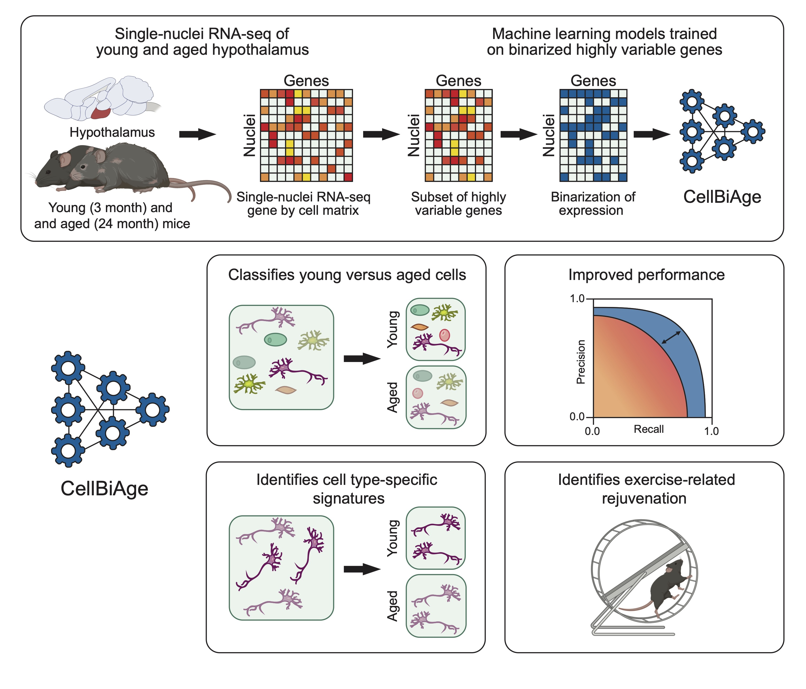

# CellBiAge
 

[Webb laboratory](https://www.webblabatbrown.com/) and [Singh laboratory](https://rsinghlab.org/) @Brown

Using [Brown's HPC (OSCAR)](https://docs.ccv.brown.edu/oscar)

ML/DL applications in predicting cellcular age using mouse brain single cell/nuclei RNA-seq. 

### 1. Models tested:
- Logistic regression with regularization
- Tree-based models
- Support Vector Machine Classifier (SVC)
- Multilayer Perceptron (MLP) 

### 2. Virtual Enviroments:

#### MLP: ```requirments_mlp.txt```
Other required packages for GPU:
```
module load cuda/11.7.1
module load cudnn/8.2.0
```
#### ML models (logistic regression, tree-based models, and SVC): ```environment_ml.yml```

### 3. Implementation:
#### MLP: ```.py``` files in the ```/scripts``` folder
In terminal: 
To implement MLP KerasTuner for group-based cross validation: 
``` 
cd scripts
python3 mlp_kt_4cv_console.py
```
To implement the best MLP over 10 random seeds: 
```
python3 mlp_rs_console.py
```
#### ML: ```.ipynb``` jupyter notebooks in the ```/scripts``` folder
- ```0x```: different preprocessing methods
- ```1x```: hypothalamus all-cell models
- ```2x```: hypothalamus cell type-specific models
- ```3x```: SVZ all-cell models
- ```4x```: SVZ cell type-specific models
- ```5x```: Bechmarking results
- ```6x```: Batch integration and misc


### 4. [Datasets](https://drive.google.com/drive/folders/1AxRl1PlOIWvgR9lBwkHN-pPNbX9ELou_?usp=sharing)
Hajdarovic, K. H., Yu, D., Hassell, L. A., Evans, S. A., Packer, S., Neretti, N., & Webb, A. E. (2022). [Single-cell analysis of the aging female mouse hypothalamus](https://www.nature.com/articles/s43587-022-00246-4). *Nature Aging*, 2(7), 662-678.

Buckley, M. T., Sun, E. D., George, B. M., Liu, L., Schaum, N., Xu, L., ... & Brunet, A. (2023). [Cell-type-specific aging clocks to quantify aging and rejuvenation in neurogenic regions of the brain](https://www.nature.com/articles/s43587-022-00335-4).  *Nature Aging*, 3(1), 121-137.

Training and testing datasets can be generated using the ```preprocessing.R``` script with the following commands:
```write.csv(t(as.matrix(sparse_integ1[top2k_hvg_intersect,])), 'test_hvg2k_std_integrated.csv')```
```write.csv(t(as.matrix(sparse_integ2[top2k_hvg_intersect,])), 'train_hvg2k_std_integrated.csv')```

Alternatively, feel free to use the already processed files available here:

[```train_final_group_info.csv``` ](https://drive.google.com/file/d/1YiSg1ck-VTnfIcDCW81P1oRzfmu9CCCb/view?usp=drive_link)

[```test_final_group_info.csv```](https://drive.google.com/file/d/1ce0V4SYZmfhMEQEFsWIQEMuFM4StFXrj/view?usp=drive_link)


